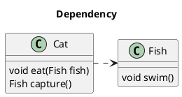
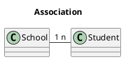
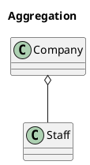
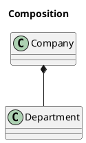
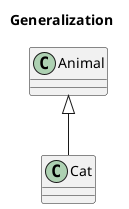
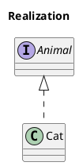

<!--
date: 2021-05-04T22:34:12+08:00
lastmod: 2021-11-21T22:34:12+08:00
-->
## UML类图

UML：Unified Modeling Language，统一建模语言。

类图：Class Diagram，UML图的一种，用来描述类之间的关系。共有六种关系：依赖关系，关联关系，聚合关系，组合关系，实现关系，泛化关系。

六种关系中，从弱到强依次是：

依赖关系 < 关联关系 < 聚合关系 < 组合关系 < 实现关系 = 泛化关系


以下类图用PlantUML绘制，官网：http://plantuml.com/

## 依赖关系（Dependency）

是对象间的一种使用关系，表示一个类依赖于另一个类。一个类对象作为另一个对象的局部变量、方法参数、返回值等，是对象间最弱的一种关系。依赖关系是在运行过程中起作用的。

在UML类图中，依赖关系用带箭头的虚线表示，箭头从使用类指向被依赖的类。



```
@startuml
title Dependency

Class Cat {
    void eat(Fish fish)
    Fish capture()
}

Class Fish {
    void swim()
}

Cat .> Fish
@enduml
```

## 关联关系（Association）

是对象间的一种引用关系，一个类对象作为另一个对象的成员变量，分为一般关联、聚合关联和组合关联。关联关系是一种静态关系，与运行过程的状态无关，在最开始就可以确定。因此也可以用 1 对 1、多对 1、多对多来表示。

在UML类图中，单向关联用一个带箭头的实线表示，箭头从使用类指向被关联的类，双向关联用带箭头或者没有箭头的实线来表示。



```
@startuml
title Association

class School
class Student
School "1" - "n" Student
@enduml
```

## 聚合关系（Aggregation）

是关联关系的一种，表示`has-a`的关系，是局部和整体的关系，且局部可以脱离整体而存在，比如公司和职员。

在UML类图中，用带空心菱形的实线来表示聚合关系，菱形指向整体。



```
@startuml
title Aggregation

class Company
class Staff
Company o-- Staff
@enduml
```

## 组合关系（Composition）

是关联关系的一种，表示`contains-a`的关系，耦合度比聚合更高，局部不可以脱离整体而存在，比如公司和部门。

在UML类图中，用带实心菱形的实线来表示组合关系，菱形指向整体。



```
@startuml
title Composition

class Company
class Department
Company *-- Department
@enduml
```

## 泛化关系（Generalization）

表示`is-a`的关系，即继承关系，是对象间耦合度最大的一种关系。子类会继承父类的所有细节，在Java中用`extends`表示。

在UML类图中，用带空心三角箭头的实线来表示泛化关系，箭头从子类指向父类。



```
@startuml
title Generalization

class Animal
class Cat
Animal <|-- Cat
@enduml
```

## 实现关系（Realization）

子类实现接口的抽象方法，在Java中用`implements`表示。

在UML类图中，用带空心三角箭头的虚线来表示实现关系，箭头从实现类指向接口。



```
@startuml
title Realization

interface Animal
class Cat
Animal <|.. Cat
@enduml
```

## 多重性（Multiplicity）

通常在关联、聚合、组合中使用。就是代表有多少个关联对象存在。使用`数字..星号（数字）`表示。

## 参考链接

* [终于明白六大类UML类图关系了](https://segmentfault.com/a/1190000021317534?utm_source=tag-newest)
* [UML类图与类的关系详解](https://www.cnblogs.com/pangjianxin/p/7877868.html)
* [类图的语法和功能](https://plantuml.com/zh/class-diagram)