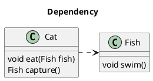
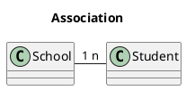
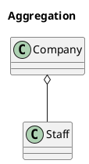
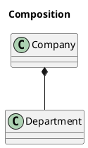
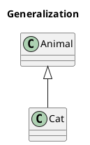
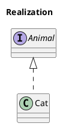

<!--
date: 2021-05-04T22:34:12+08:00
lastmod: 2021-05-18T22:34:12+08:00
-->
## 什么是OOP？类与对象的关系？

OOP就是`Object Oriented Programming`，面向对象编程。

类是对象的抽象，对象是类的具体。类是对象的模板，对象是类的实例。

## 面向对象的三大特性

抽象：找共性，将一类对象的共同特征总结出来构造类的过程, 包括数据抽象和行为抽象两方面。抽象只关注对象有哪些属性和行为，并不关注这些行为的具体细节。

### 封装

把数据和操作数据的方法绑定起来，对数据的访问只能通过已定义的接口。隐藏一切可隐藏的东西，只向外界提供最简单的编程接口。

### 继承

继承实现了`is-a`关系，子类继承父类的所有属性和方法（包括私有属性和方法，只是不能直接访问），可以重用，也可以覆盖。

继承应该遵循里氏替换原则，子类对象必须能够替换掉所有父类对象。父类引用指向子类对象称为**向上转型**。

### 多态

分编译时的多态和运行时的多态。运行时多态指程序中定义的对象引用所指向的具体类型在运行期间才确定。

方法重载（overload）实现的是编译时的多态性（也称为前绑定），而方法重写（override）实现的是运行时的多态性（也称为后绑定）。

要实现运行时的多态要满足：

● 方法重写，即子类重写父类的方法<br>
● 对象造型（向上转型），即父类引用指向子类对象

## 面向对象和面向过程的区别

● 面向过程是一种较早的编程思想，属于面条式编程，站在过程的角度上思考问题。强调的是功能行为，功能的执行过程，按顺序一步步去实现功能的设计和调用。<br>
● 面向对象是一种基于面向过程的新编程思想，站在对象的角度上思考问题。强调的是具备某些功能的对象，通过面向抽象编程来实现低耦合、高内聚。

## UML类图

UML：Unified Modeling Language，统一建模语言。

类图：Class Diagram，UML图的一种，用来描述类之间的关系。共有六种关系：依赖关系，关联关系，聚合关系，组合关系，实现关系，泛化关系。

六种关系中，从弱到强依次是：

依赖关系 < 关联关系 < 聚合关系 < 组合关系 < 实现关系 = 泛化关系


以下类图用PlantUML绘制，官网：http://plantuml.com/

### 依赖关系（Dependency）

是对象间的一种使用关系，表示一个类依赖于另一个类。一个类对象作为另一个对象的局部变量、方法参数、返回值等，是对象间最弱的一种关系。依赖关系是在运行过程中起作用的。

在UML类图中，依赖关系用带箭头的虚线表示，箭头从使用类指向被依赖的类。



```
@startuml
title Dependency

Class Cat {
    void eat(Fish fish)
    Fish capture()
}

Class Fish {
    void swim()
}

Cat .> Fish
@enduml
```

### 关联关系（Association）

是对象间的一种引用关系，一个类对象作为另一个对象的成员变量，分为一般关联、聚合关联和组合关联。关联关系是一种静态关系，与运行过程的状态无关，在最开始就可以确定。因此也可以用 1 对 1、多对 1、多对多来表示。

在UML类图中，单向关联用一个带箭头的实线表示，箭头从使用类指向被关联的类，双向关联用带箭头或者没有箭头的实线来表示。



```
@startuml
title Association

class School
class Student
School "1" - "n" Student
@enduml
```

### 聚合关系（Aggregation）

是关联关系的一种，表示`has-a`的关系，是局部和整体的关系，且局部可以脱离整体而存在，比如公司和职员。

在UML类图中，用带空心菱形的实线来表示聚合关系，菱形指向整体。



```
@startuml
title Aggregation

class Company
class Staff
Company o-- Staff
@enduml
```

### 组合关系（Composition）

是关联关系的一种，表示`contains-a`的关系，耦合度比聚合更高，局部不可以脱离整体而存在，比如公司和部门。

在UML类图中，用带实心菱形的实线来表示组合关系，菱形指向整体。



```
@startuml
title Composition

class Company
class Department
Company *-- Department
@enduml
```

### 泛化关系（Generalization）

表示`is-a`的关系，即继承关系，是对象间耦合度最大的一种关系。子类会继承父类的所有细节，在Java中用`extends`表示。

在UML类图中，用带空心三角箭头的实线来表示泛化关系，箭头从子类指向父类。



```
@startuml
title Generalization

class Animal
class Cat
Animal <|-- Cat
@enduml
```

### 实现关系（Realization）

子类实现接口的抽象方法，在Java中用`implements`表示。

在UML类图中，用带空心三角箭头的虚线来表示实现关系，箭头从实现类指向接口。



```
@startuml
title Realization

interface Animal
class Cat
Animal <|.. Cat
@enduml
```

### 多重性（Multiplicity）

通常在关联、聚合、组合中使用。就是代表有多少个关联对象存在。使用`数字..星号（数字）`表示。

## 面向对象的设计原则

面向对象程序设计有六大原则：

● **单一职责原则。**

第一个原则针对实现类，要求实现类的设计要遵循单一职责，不要负责多个职责，以此降低耦合。

● **里氏替换原则。**

第二个原则针对类的继承，要求不要破坏类的继承体系。子类应该尽量不要重写或者重载父类的行为（不包括抽象方法），这样子类才能安全地替换父类的所在。

● **依赖倒置原则。**

第三个原则针对抽象化，要求面向接口编程，面向抽象编程。不要依赖于具体，要依赖于抽象。

● **接口隔离原则。**

第四个原则针对接口，要求接口的设计要精简单一，类似于类的单一职责原则，不过一个是针对实现类，一个是针对接口。

● **迪米特法则**，也叫**最少知道原则。**

第五个原则针对对象间的关联关系，要求一个对象对于关联的其他对象要保持最少的了解。这样才能够保证低耦合，高内聚。

● **开闭原则。**

第六个原则是总纲，前面五个原则都是为了实现该原则，即对扩展开放，对修改关闭。符合开闭原则最典型的设计模式是装饰者模式，它可以动态地将责任附加到对象上，而不用去修改类的代码。
 
Java的23个设计模式就是为了遵从面向对象程序设计的这六个原则而总结出来的设计。

## Java语言有哪些特点？

● 简单易学，有丰富的类库<br>
● 面向对象<br>
● 平台无关性，即跨平台<br>
● 可靠安全<br>
● 支持多线程

## JRE和JDK

● JRE：Java Runtime Environment，Java运行环境的简称，为Java的运行提供了所需的环境。它是一个JVM程序，主要包括了JVM的标准实现和一些Java基本类库。<br>
● JDK：Java Development Kit，Java开发工具包，提供了Java的开发及运行环境。JDK是Java开发的核心，集成了JRE以及一些其它的工具，比如编译Java源码的编译器javac等。

## 一个".java"源文件中是否可以包含多个类（不是内部类）？有什么限制？

可以，但一个源文件中最多只能有一个公开类（public class）而且文件名必须和公开类的类名完全保持一致。

## Java标识符的命名规则

● 标识符由26个英文字符大小写（a~z，A~Z）、数字(0~9)、下划线(_)和美元符号($)组成；<br>
● 不能以数字开头，不能是关键字；<br>
● 严格区分大小写；<br>
● 标识符可以为任意长度；

## 比较一下Java和JavaSciprt

● 基于对象和面向对象：Java是一种真正的面向对象的语言，即使是开发简单的程序，必须设计对象；JavaScript是种脚本语言，它可以用来制作与网络无关的，与用户交互作用的复杂软件。它是一种基于对象（Object-Based）和事件驱动（Event-Driven）的编程语言，因而它本身提供了非常丰富的内部对象供设计人员使用。

● 解释和编译：Java的源代码在执行之前，必须经过编译。JavaScript是一种解释性编程语言，其源代码不需经过编译，由浏览器解释执行。（目前的浏览器几乎都使用了JIT（即时编译）技术来提升JavaScript的运行效率）

● 强类型变量和弱类型变量：Java采用强类型变量检查，即所有变量在编译之前必须作声明；JavaScript中变量是弱类型的，甚至在使用变量前可以不作声明，JavaScript的解释器在运行时检查推断其数据类型。

● 代码格式不一样。

## 形参与实参区别

### 实参（argument）

全称为"实际参数"，是在调用时传递给函数的参数。在进行函数调用时，实参必须具有确定的值，以便把这些值传送给形参。

### 形参（parameter）

全称为"形式参数"，由于它不是实际存在的变量，所以又称虚拟变量。是在定义函数名和函数体的时候使用的参数，目的是用来接收调用该函数时传入的参数。在调用函数时，实参将赋值给形参。因而，必须注意实参的个数、类型应与形参一一对应，并且实参必须要有确定的值。

## 数组实例化有几种方式

静态实例化：创建数组的时候已经指定数组中的元素。
```java
int [] a= new int[]{ 1 , 3 , 3}
```

动态实例化：实例化数组的时候，只指定了数组长度，数组中所有元素都是数组类型的默认值。

## 参考链接

* [面向对象思想](http://cyc2018.gitee.io/cs-notes/#/notes/面向对象思想)
* [终于明白六大类UML类图关系了](https://segmentfault.com/a/1190000021317534?utm_source=tag-newest)
* [UML类图与类的关系详解](https://www.cnblogs.com/pangjianxin/p/7877868.html)
* [类图的语法和功能](https://plantuml.com/zh/class-diagram)