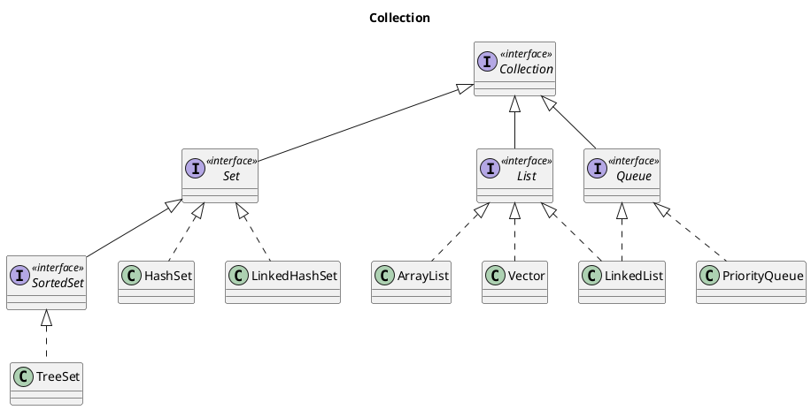
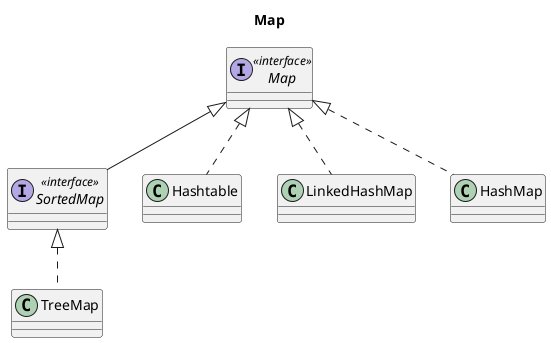
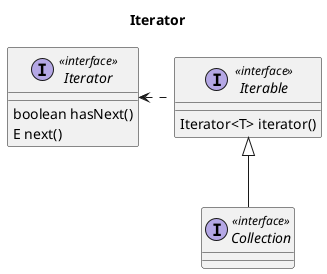

<!--
date: 2021-05-15T22:34:12+08:00
lastmod: 2021-05-17T22:34:12+08:00
-->
## Java的数据结构

数据结构是计算机存储、组织数据的方式。Java的数据结构有以下几种：

1. 数组（Array）
2. 线性表（ArrayList）
3. 链表（LinkedList）
4. 集合（Set）
5. 栈（Stack）
6. 队列（Queue）
7. 图（Map）
8. 树（Tree）

这些数据结构在Java中统称为容器，主要分为`Collection`和`Map`两种：`Collection`存储着对象的集合，` Map`存储着键值对（两个对象）的映射表。

## Collection



```
@startuml
title Collection
interface Collection <<interface>>

interface Set <<interface>>
interface List <<interface>>
interface Queue <<interface>>

Collection <|-- Set
Collection <|-- List
Collection <|-- Queue

interface SortedSet <<interface>>
class HashSet
class LinkedHashSet

Set <|-- SortedSet
Set <|.. HashSet
Set <|.. LinkedHashSet

class TreeSet
SortedSet <|.. TreeSet

class ArrayList
class Vector
class LinkedList

List <|.. ArrayList
List <|.. Vector
List <|.. LinkedList

class PriorityQueue

Queue <|.. LinkedList
Queue <|.. PriorityQueue
@enduml
```

## Map



```
@startuml
title Map
interface Map <<interface>>
interface SortedMap <<interface>>

Map <|-- SortedMap

class TreeMap
SortedMap <|.. TreeMap

class Hashtable
class LinkedHashMap
class HashMap

Map <|.. Hashtable
Map <|.. LinkedHashMap
Map <|.. HashMap
@enduml
```

## 容器中的设计模式

### 迭代器模式



### 适配器模式


## 参考链接

* [Java 容器](http://cyc2018.gitee.io/cs-notes/#/notes/Java%20容器)
