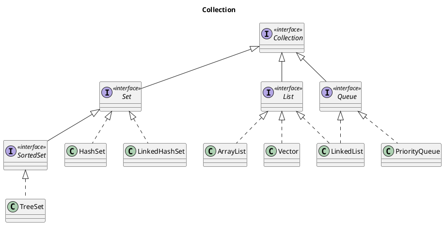
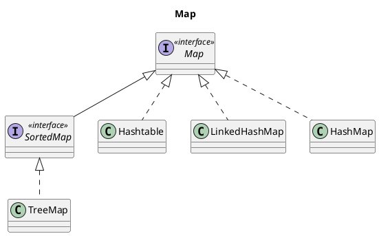
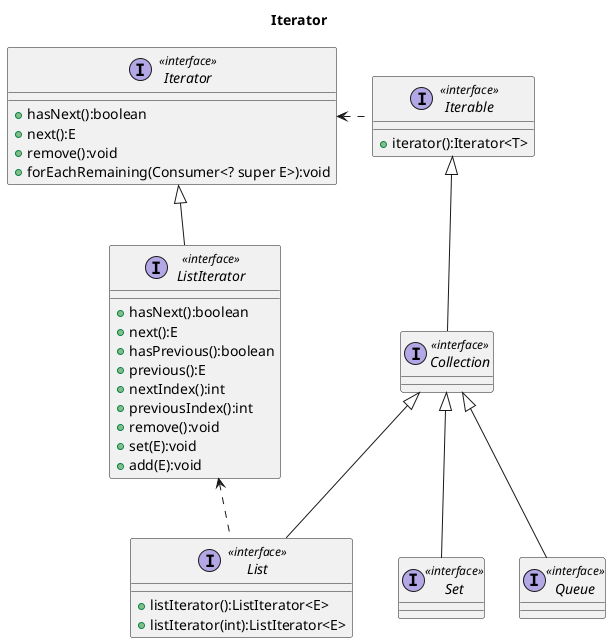

<!--
date: 2021-05-15T22:34:12+08:00
lastmod: 2021-06-03T22:34:12+08:00
-->
## 算法复杂度

算法复杂度可以体现出某个算法的耗时/耗空间与数据量增长之间的关系/趋势，通常指的是时间复杂度，在实际开发中往往更倾向于用空间换取时间的方案，当然如果能二者兼得更好。

常见的复杂度有：`O(1)`、`O(n)`、`O(logn)`、`O(nlogn)`。

算法复杂度的推导遵循3个原则：

● 如果运行时间跟n无关，是常数，则时间复杂度是O(1)；<br>
● 只保留时间函数中的最高阶项；<br>
● 去掉高阶项前面的系数；

|时间复杂度|描述|举例|
|:-|:-|:-|
|O(1)|耗时与输入数据量大小无关|哈希算法（不考虑哈希冲突）|
|O(n)|耗时呈线性增长|遍历算法|
|O(n<sup>2</sup>)|耗时呈平方增长|嵌套循环|
|O(logn)|耗时是对数函数，随着输入数据量的增大而耗时增长缓慢，复杂度比线性低。这里的底数并不重要，复杂度的目的是体现出耗时随着数据量增大的增长趋势。|二分查找算法|
|O(nlogn)|耗时是一个多项式，复杂度高于线性，但低于平方|归并排序|

## Java的数据结构

数据结构是计算机存储、组织数据的方式。Java的数据结构主要有以下几种：

● 数组（Array）<br>
● 线性表（ArrayList）<br>
● 链表（LinkedList）<br>
● 集合（Set）<br>
● 栈（Stack）<br>
● 队列（Queue）<br>
● 图（Map）<br>
● 树（Tree）<br>

这些数据结构在Java中统称为容器，主要分为`Collection`和`Map`两种：`Collection`存储着对象的集合，` Map`存储着键值对（两个对象）的映射表。

## Collection



### Set

**TreeSet**: 基于红黑树实现，支持有序性操作，例如根据一个范围来查找元素。但是查找效率不如HashSet，HashSet查找的时间复杂度为O(1)，TreeSet为O(logN)。

**HashSet**：基于哈希表实现，支持快速查找，但不支持有序性操作，属于无序集合，如果使用Iterator遍历元素，得到的结果是不确定的。

**LinkedHashSet**：具有HashSet的查找效率，并且内部使用双向链表维护元素的插入顺序。

### List

**ArrayList**：基于动态数组实现，支持随机访问。

**Vector**：和ArrayList类似，但它是线程安全的。

**LinkedList**：基于双向链表实现，只能顺序访问，查找效率较慢，但是可以快速插入和删除元素。此外，LinkedList还可以用作栈、队列和双向队列。

* [Java集合类："随机访问" 的RandomAccess接口](https://www.cnblogs.com/yeya/p/9950723.html)

### Queue

**LinkedList**：可以用它来实现队列和双向队列。

**PriorityQueue**：基于堆结构实现，可以用它来实现优先队列。

## Map



**TreeMap**：基于红黑树实现。

**HashMap**：基于哈希表实现。

**Hashtable**：和HashMap类似，但它是线程安全的。它是遗留类，不应该去使用它，而是使用 ConcurrentHashMap来支持线程安全，ConcurrentHashMap的效率会更高，因为ConcurrentHashMap引入了分段锁。

**LinkedHashMap**：使用双向链表来维护元素的顺序，顺序为插入顺序或者最近最少使用（LRU）顺序。可以用来实现一个简单的LRU缓存。

## 容器中的设计模式

### 迭代器模式



Collection接口继承了Iterable接口，通过其提供的`iterator()`可以获取集合对应的迭代器来遍历集合中的元素。

从Java5开始引入了泛型，因此可以对使用了泛型的集合进行增强for循环（即foreach遍历，实际上底层用的是迭代器来遍历，这种语法属于语法糖syntactic sugar)：

```java
List<String> list = Arrays.asList("aa", "bb", "cc");
for (String string : list) {
    System.out.println(string);
}
```

### 适配器模式

`java.util.Arrays#asList()`可以把数组类型转换为List类型（是Arrays的内部类ArrayList，虽然和常用的ArrayList同名，但只支持不改变数据结构的操作，如get、set等）。

由于`asList()`的参数为泛型T的可变数组，如果传入一个基本数据类型的数组时，会得到不一样的结果，因为泛型T不接收基本数据类型，也不会自动装箱，所以会把整个基本数据类型数组传递给T：

```java
Integer[] arr = {1, 2, 3};
List list = Arrays.asList(arr);
System.out.println(list.size());  // 3
System.out.println(list);  // [1, 2, 3]

int[] arr2 = {1, 2, 3};
list = Arrays.asList(arr2);
System.out.println(list.size());  // 1
System.out.println(Arrays.toString((int[]) list.get(0)));  // [1, 2, 3]
```

## 参考链接

* [Java 容器](http://cyc2018.gitee.io/cs-notes/#/notes/Java%20容器)
* [O(1), O(n), O(logn), O(nlogn) 的区别](https://blog.csdn.net/ted_cs/article/details/82881831)
